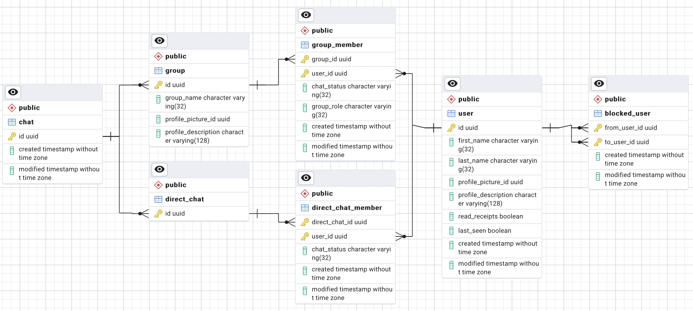

# Social DB
## About
- The DB of the Social service
- The schema is designed for consistency over performance and to allow for polymorphic queries
- To see an extended argument about the entities, please see the domain model of the Social service

## Technologies
- PostgreSQL: RDBMS
- pgAdmin: Administration and development platform for PostgreSQL
- Kubernetes: Deployment
- Docker Compose: Local Deployment

## Structure
- pgadmin:
  - pgadmin-*.yml: Draft files for Kubernetes
  - servers.json: Specify the default server connection
- social-db:
  - social-db-*.yml: Draft files for Kubernetes
  - social-db-1-config.sql: Database configuration
  - social-db-2-schema.sql: Schema definition
- docker-compose.yml: Internal test deployment
- social-db-kube.zsh: Script to add all manifests to a cluster

- Notes:
  - There are no Dockerfiles as only environment variables and some files are passed and nothing
    special is built
  - The SQL scripts are numbered so that they are executed in the right order

## ER-Diagram
### Current Schema
- TODO newest version does not have updated strings for profile pictures


### How to create an ER-Diagram in pgAdmin
1. Open pgAdmin
2. Navigate to `social-db-group` -> `social-db` -> `Databases` -> `social-db` -> `Schemas`
3. Right click on `public` and click `ERD For Schema`

## Deployment
### Kubernetes
Run the `social-db-deploy.zsh` script relative to the Y-Chat root directory on your cluster.

### Docker Compose
1. Change to the Y-Chat root directory
2. Start Docker Compose with the `social-db-compose.yml` file:
```shell
docker-compose -f "social-db-compose.yml" up -d
```
3. Verify that everything started correctly:
```shell
docker-compose -f "social-db-compose.yml" ps
```
4. Connect to pgAdmin via `localhost:55050` and enter the following credentials (it may take some
   time until all containers are properly booted and initialized):
- Username: `ychat@ychat.com`
- Password: `ychatformerlyknownas`
5. Connect to the `social-db` with the password `ychatformerlyknownas`