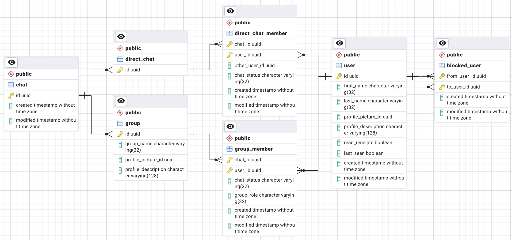

# Social DB
## About
- The DB of the Social service
- The schema is designed for consistency over performance and to allow for polymorphic queries
- To see an extended argument about the entities, please see the domain model of the Social service

## Technologies
- PostgreSQL: RDBMS
- pgAdmin: Administration and development platform for PostgreSQL
- Kubernetes: Deployment
- Docker Compose: Local Deployment

## Structure
- pgadmin:
  - pgadmin-*.yml: Draft files for Kubernetes
  - servers.json: Specify the default server connection
- social-db:
  - social-db-*.yml: Draft files for Kubernetes
  - social-db-1-config.sql: Database configuration
  - social-db-2-schema.sql: Schema definition
- docker-compose.yml: Internal test deployment
- social-db-kube.zsh: Script to add all manifests to a cluster

- Notes:
  - There are no Dockerfiles as only environment variables and some files are passed and nothing
    special is built
  - The SQL scripts are numbered so that they are executed in the right order

## ER-Diagram
### Current Schema

### How to create an ER-Diagram in pgAdmin
1. Open pgAdmin
2. Navigate to `social-db-group` -> `social-db` -> `Databases` -> `social-db` -> `Schemas`
3. Right click on `public` and click `ERD For Schema`
