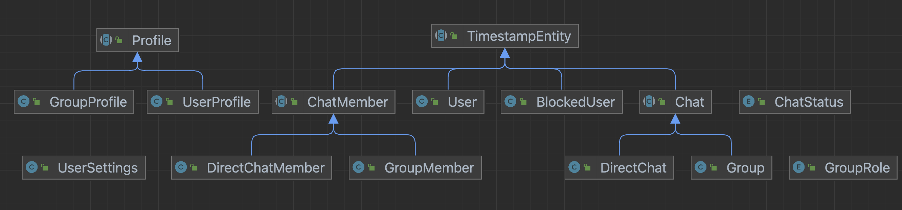

# Social Service
## About
- The Social service manages users, groups, and chats and their relationships
- It enables the frontend and the other services to not worry about the consistency and business
  logic of most of the domain model.

## API
- The API is documented with OpenAPI
- It is auto-generated from the service which has some limitations, especially for the validation,
  as the documentation does not differentiate between update and creation although the service does;
  for these special cases extra documentation can be found at the endpoints
- One can find the JSON file at the `/internal/api-docs` endpoint and the
  YAML version at `/internal/api-docs.yaml`
- A visualization of the API can be accessed at `/internal/swagger-ui`

## Implementation
### Technologies
- Language: Java, Spring Boot, Maven, Eclipse Temurin
- API: OpenAPI, Springdoc
- ORM and Validation: Jakarta, Spring Data JPA
- Security: Spring Security, JWT, Firebase
- Testing: Spring Test
- DB: See the `social-db`

### Object Model

### Validation
1. Syntax, type, and authentication issues are caught immediately at the controller layer
2. The service layer validates the input and authorizes the request against the business logic
3. The model layer defines the correct syntax and guarantees data consistency
4. The DB constraints act as a last stronghold, even though the application should have filtered out
   all issues by then

### Testing
- Complex queries are tested as integration tests against a real database on the repository level
- The service layer is tested as unit tests with a mocked out repository layer
- Finally, there are integration tests for each endpoint which load the whole application context
- Each part of the model has a builder class to decouple the tests from the domain model and make
  state management in tests easier
- For brevity, we left out the unit tests for the controller layer and the DTO converter
